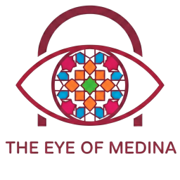
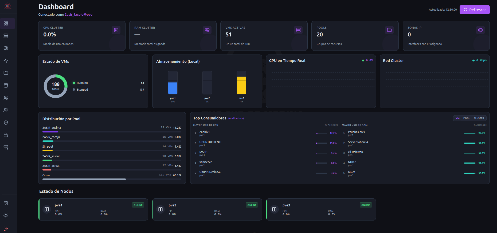
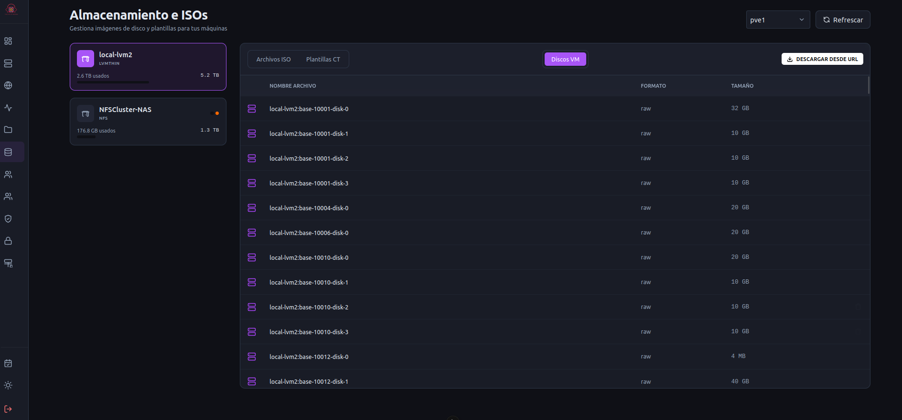
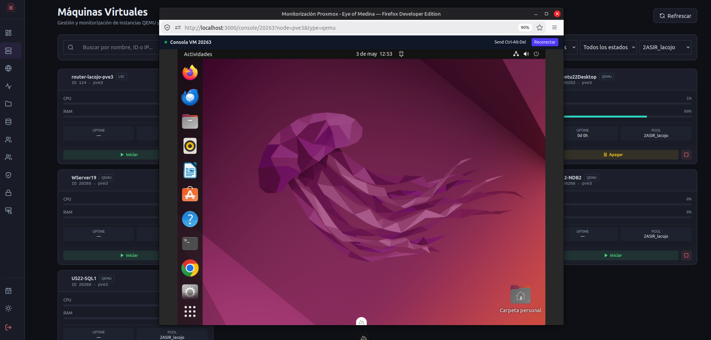
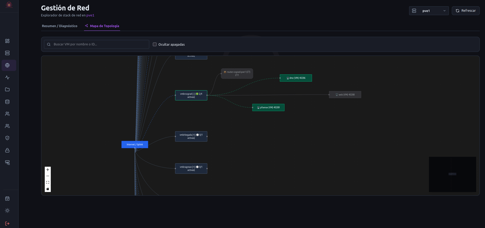

# Eye of Medina

<div align="center">



**Panel de Control Web Moderno para el Monitoreo y Gestión de Proxmox VE**

[](https://nuxt.com)
[](https://vuejs.org)
[](https://www.typescriptlang.org)
[](https://tailwindcss.com)

</div>

<br>

<p align="center">
  
</p>

---

## ✨ Características

### Panel de Control 2.0
- **Diseño de Alta Densidad**: Rejilla de 4 columnas optimizada para pantallas grandes (`KPIs` + `Estado` + `Almacenamiento` + `CPU` + `Red`).
- **Métricas en Tiempo Real**: Monitoreo en vivo de **CPU del Cluster**, **Almacenamiento por Nodo** y **Tráfico de Red** (Mbps).
- **Gráficos Interactivos**: Gráfico de dona para el estado de las VMs, capacidad de almacenamiento y tendencias históricas.
- **Top Consumidores**: Análisis detallado del consumo de recursos (CPU/RAM) con vistas de **VM**, **Pool** y **Cluster**.
- **Salud del Nodo**: Estado de salud y métricas para cada nodo del cluster.
- **Registro de Tareas (Cajón de Tareas)**: Panel lateral deslizante con el historial de tareas del cluster en tiempo real.

### Gestión de Almacenamiento (¡NUEVO!)

<p align="center">
  
</p>

- **ISO y Plantillas**: Explora y gestiona contenido en todos los almacenamientos del cluster.
- **Descarga desde URL**: Descarga directa de ISOs/Imágenes a los nodos de almacenamiento de Proxmox.
- **Exploración Visual**: Filtra por tipo de contenido (ISO, Respaldo, Plantilla CT, Discos VM, Fragmento).

### Gestión de Máquinas Virtuales
- **Filtrado Avanzado**: Por nombre, ID, tipo y pool.
- **Clonación**: Clona VMs/CTs seleccionando el pool de destino.
- **Edición**: Modifica nombres, nombre de host y asignación de pool.
- **Iniciar/Detener/Apagar**: Con confirmación de seguridad.
- **Eliminación Segura**: Con doble confirmación.

### 🖥️ Consola VNC Integrada (¡NUEVO!)

<p align="center">
  
</p>

- **Acceso Directo a la Consola**: Conéctate a las VMs y contenedores directamente desde el navegador.
- **Proxy WebSocket del Lado del Servidor**: Conexión segura sin requerir una sesión de Proxmox separada.
- **Basado en noVNC**: Soporte completo para teclado y mouse.
- **Enviar Ctrl-Alt-Del**: Acción con un solo clic.
- **Reconexión Automática**: Manejo semántico de pérdidas de conexión.

### Gestión de Red

<p align="center">
  
</p>

- **Zonas IP Inteligentes**: Visualización de Redes L3 con IPs activas.
- **Tarjetas IP Visuales**: Tarjetas interactivas para IPv4/IPv6 con opción "Clic para copiar".
- **Mapa de Topología Interactivo**: Lienzo visual avanzado (Vue Flow) con minimapa, zoom e indicadores de estado animados.
- **Grid de Red Inteligente**: Nodos colapsables por puente para mantener la interfaz limpia.
- **Búsqueda y Filtrado**: Filtro interactivo para ocultar máquinas apagadas y buscador en tiempo real.

### Gestión de Identidad y Acceso (IAM)
- **Gestión de Pools, Grupos, Usuarios, Roles y ACLs**.
- **Árbol de Permisos**: Auditoría visual de los permisos efectivos.
- **Alineación con Proxmox**: Totalmente alindado con el modelo de permisos de PVE.

### Experiencia de Usuario
- **Modo Claro/Oscuro**: Con detección automática.
- **Diseño Responsivo**: Optimizado para escritorio y tabletas.
- **Transiciones Suaves**: Navegación fluida entre páginas.

---

## 🚀 Instalación

### Prerrequisitos
- Node.js 20+
- Acceso HTTPS al host de Proxmox (puerto 8006)

### Variables de Entorno

```env
# URL de tu servidor Proxmox
NUXT_PUBLIC_PROXMOX_HOST=https://tu-proxmox:8006

# Solo para desarrollo (para certificados autofirmados)
ALLOW_INSECURE_TLS=true
```

### Configuración

```bash
# Instalar dependencias
npm install

# Servidor de Desarrollo
npm run dev

# Compilación de Producción
npm run build
npm run preview
```

Abre [http://localhost:3000](http://localhost:3000) para acceder al panel de control.

---

## 🏗️ Arquitectura

```
eye_of_Medina/
├── app/
│   ├── pages/           # Páginas de la aplicación
│   │   ├── console/     # Consola VNC Integrada
│   │   ├── machines/    # Gestión de VM/CT
│   │   └── ...
│   ├── components/      # Componentes reutilizables
│   ├── composables/     # Lógica compartida (useProxmox, etc.)
│   └── assets/          # CSS y recursos estáticos
├── server/
│   ├── api/proxmox/     # Proxy de la API de Proxmox
│   └── routes/_ws/      # Proxy WebSocket para VNC
└── nuxt.config.ts       # Configuración de Nuxt
```

### Tecnologías Clave
- **Nuxt 4** con servidor Nitro
- **Vue 3** Composition API
- **TypeScript** para tipado estático
- **TailwindCSS 4** para estilos
- **noVNC** para la consola remota
- **WebSocket Nativo** (Nitro) para el proxy de VNC

---

## 📖 Documentación

- [Guía de Integración con Proxmox](Eye_of_Medina.ES.md) - Autenticación, permisos y API.
- [Manual de Usuario](manual.ES.md) - Guía de uso del panel de control.

---

## 🧪 Pruebas

El proyecto incluye una suite de pruebas completa que garantiza la calidad del código y previene regresiones:

### Pruebas E2E (Playwright)
Pruebas de extremo a extremo que simulan interacciones reales del usuario en toda la aplicación.
```bash
# Ejecutar pruebas en CLI
npm run test:e2e

# Abrir el modo interactivo de la interfaz de Playwright
npm run test:e2e:ui
```

### Pruebas Unitarias y Cobertura (Vitest)
Pruebas unitarias rápidas que evalúan componentes individuales y composables de Vue en un entorno aislado, utilizando Vitest y happy-dom.
```bash
# Ejecutar pruebas unitarias
npm run test

# Ejecutar pruebas y generar reporte de cobertura V8 (ver en /coverage/index.html)
npm run test:coverage
```

---

## 🔐 Autenticación

### API Token (Recomendado)
```
Token ID: usuario@realm!nombre-token
Secret: xxxxxxxx-xxxx-xxxx-xxxx-xxxxxxxxxxxx
```

### Usuario/Contraseña
```
Usuario: usuario@pam o usuario@pve
Contraseña: tu-contraseña
```

---

## 🤝 Contribuir

Las contribuciones son bienvenidas. Por favor, sigue estos pasos:
1. Haz un fork del repositorio.
2. Crea una rama para tu característica (`git checkout -b feature/nueva-caracteristica`).
3. Confirma tus cambios (`git commit -m 'feat: Agregar nueva característica'`).
4. Sube la rama (`git push origin feature/nueva-caracteristica`).
5. Abre un Pull Request.

---

## 📄 Licencia

Este proyecto está bajo la Licencia MIT. Consulta [LICENSE](LICENSE) para más detalles.

---

## 👨‍💻 Autor

**José Lafuente Colorado**  
<small>
🌐 [joselafuente.dev](https://www.joselafuente.dev) &nbsp;·&nbsp;
🐙 [GitHub](https://github.com/LafuenteColoradoJose) &nbsp;·&nbsp;
💼 [LinkedIn](https://www.linkedin.com/in/joselafuentecolorado)
</small>

---

<div align="center">

<small>**Desarrollado con ❤️ para la comunidad de Proxmox**</small>

</div>
